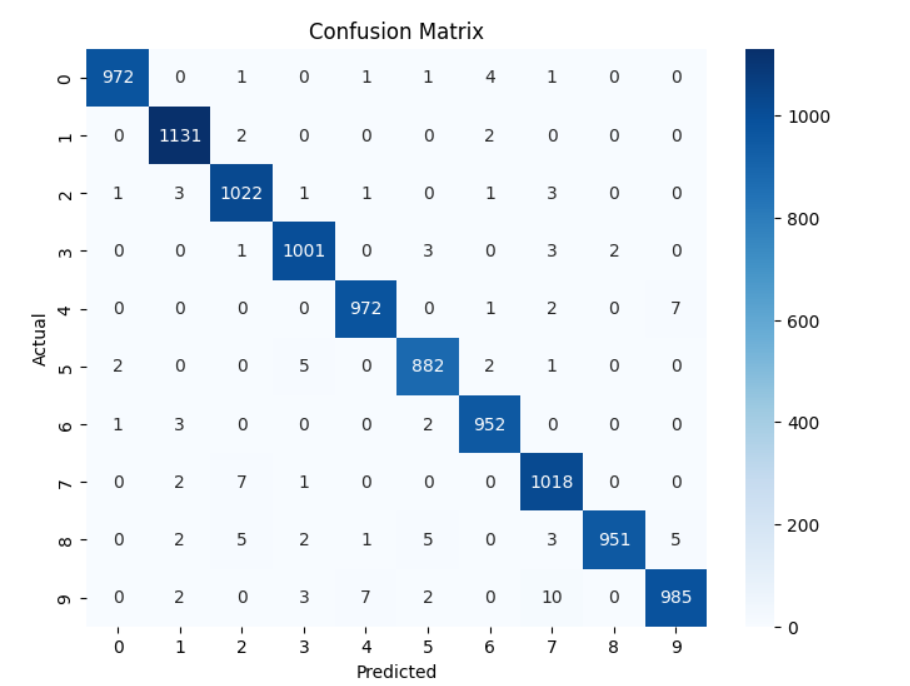
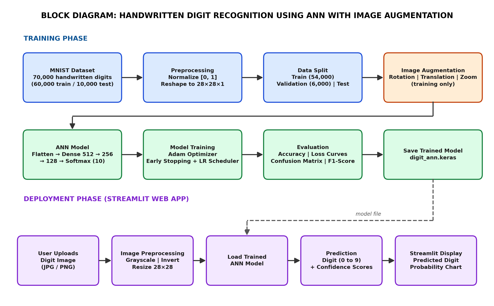

# Deep Learning-Based Handwritten Digit Recognition Using ANN with Image Augmentation

An Artificial Neural Network trained on the MNIST dataset with image augmentation
(rotation, translation, zoom) and deployed as an interactive Streamlit web app.

## Features
- ANN classifier with Batch Normalization and Dropout
- Image augmentation to improve generalization
- Evaluation with accuracy, loss curves, confusion matrix and F1-score
- Streamlit app: upload a digit image, get the prediction with class-wise confidence

## Tech Stack
| Area | Tools |
|---|---|
| Language | Python 3 |
| Deep Learning | TensorFlow / Keras |
| Web App | Streamlit |
| Evaluation | scikit-learn, Matplotlib, Seaborn |
| Dataset | MNIST (70,000 handwritten digits) |

## Model Architecture
Input (28x28x1) -> Augmentation -> Flatten -> Dense 512 -> Dense 256 -> Dense 128 -> Softmax (10)

## Results
| Metric | Value |
|---|---|
| Test Accuracy | 98.86% |
| Test Loss | 0.0345 |




## Block Diagram


## How to Run
```bash
git clone https://github.com/ArunkarthickS-04/Deep-learning-Mini-project.git
cd Deep-learning-Mini-project
pip install -r requirements.txt
streamlit run app.py
```

Test the app with the images in `sample_inputs/`.

## Project Structure
```
handwritten-digit-recognition-ann/
├── README.md
├── requirements.txt
├── .gitignore
├── app.py
├── notebooks/
│   └── digit_recognition_ann.ipynb
├── models/
│   └── digit_ann.keras
├── sample_inputs/
│   ├── test1_clean_digit.png
│   ├── test2_rotated_shifted_digit_3.png
│   └── test3_ambiguous_....png
├── results/
│   ├── confusion_matrix.png
│   └── streamlit_app.png
└── docs/
    └── block_diagram.png
```

## Team
| Name | Roll No. | GitHub |
|---|---|---|
| MADEV KUMAR B  | 727624BAM001 | @madevkumar |
| NARASIMMAN N M | 727624BAM002 | @Narasimman07-ml |
| PRASHEETHA K   | 727624BAM003 | @PrasheethaKarthikeyan |
| ARUNKARTHICK S | 727624BAM004 | @ArunkarthickS-04 |

